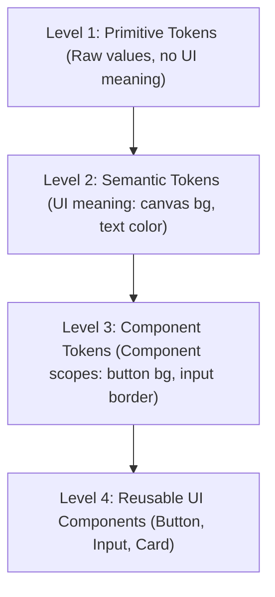

# 🔬 Design Token Engine Architecture (`tokens`)

This directory houses the core Design Token Engine for the standalone **design-web** project. It serves as the single source of truth for visual system properties: colors, spacing, borders, radius, shadows, typography, opacity, motion physics, and layout guidelines.

---

## 🏗️ The 3-Tier Design Token Hierarchy

Our architecture strictly separates tokens into three layers to ensure extreme scalability and maintainability:



---

## 📂 Modular Token Documentation

Each file has a single responsibility. Below is the documentation for each module in the directory:

---

### 1. `primitives.ts`
- **Purpose**: Defines raw, context-free design values (e.g. Hex color scales, 8px-spacing array, base shadows, base border radius, opacities, and z-index values).
- **Usage**: Used strictly by other token files to bind semantic variables.
- **Example**: `COLOR_SCALES.blue[500]` -> `#3b82f6`
- **When to use**: When assigning a raw property scale value to a semantic meaning.
- **When NOT to use**: Never import `primitives.ts` directly into visual UI components. Doing so bypasses the semantic layer, breaking light/dark mode adjustments.
- **Future extension**: Add custom gray-scale tinting (e.g., slate-gray, zinc-gray) or custom brand color primitives.

---

### 2. `background.ts`
- **Purpose**: Manages canvas, surface, and container background color states for light/dark modes.
- **Usage**: Defines default panel color schemes and component backgrounds.
- **Example**: `background.semantic.canvas.dark` -> `COLOR_SCALES.gray[950]`
- **When to use**: When styling the backdrop of a panel, overlay modal, card container, or body.
- **When NOT to use**: When styling text borders or foreground text.
- **Future extension**: Add multi-layer elevation states (e.g., `background.semantic.surfaceLevel3`).

---

### 3. `foreground.ts`
- **Purpose**: Manages text, icon, and primary content foreground colors.
- **Usage**: Governs text variants (primary, secondary, link, inverse, muted).
- **Example**: `foreground.semantic.primary.light` -> `COLOR_SCALES.gray[900]`
- **When to use**: When setting the color properties of typography, headers, or Lucide icons.
- **When NOT to use**: Do not use to set background or border color properties.
- **Future extension**: Add customized warning and success message header colors.

---

### 4. `surface.ts`
- **Purpose**: Maps containers that sit on top of background canvas panels (raised dialogs, popovers, headers).
- **Usage**: Maps surfaces for cards, tables, popovers, and sidebars.
- **Example**: `surface.semantic.raised.dark` -> `COLOR_SCALES.gray[800]`
- **When to use**: When constructing modal containers or floating preference panels.
- **When NOT to use**: For standard text backgrounds (use `background.ts` canvas).
- **Future extension**: Add support for translucent glassmorphic surfaces using background-blur variables.

---

### 5. `border.ts`
- **Purpose**: Manages divider lines, inputs boundaries, and keyboard accessibility focus rings.
- **Usage**: Feeds cards, separators, input field lines, and outline buttons.
- **Example**: `border.semantic.base.light` -> `COLOR_SCALES.gray[200]`
- **When to use**: Drawing divider lines or highlighting hover focus states.
- **When NOT to use**: When specifying margins or layout gaps.
- **Future extension**: Add custom dash-array border tokens for drop-zones.

---

### 6. `primary.ts`
- **Purpose**: Manages primary brand actions, main buttons, active tabs, and key focus rings.
- **Usage**: Powers primary call-to-actions, active navigation highlights, and contrast labels.
- **Example**: `primary.semantic.base.light` -> `COLOR_SCALES.violet[500]`
- **When to use**: When drawing core interactive triggers.
- **When NOT to use**: For neutral body copy or secondary controls.
- **Future extension**: Enable dynamic secondary primary brand color scales.

---

### 7. `secondary.ts`
- **Purpose**: Manages secondary actions, neutral buttons, badge counters, and secondary outlines.
- **Usage**: Feeds secondary elements, low-contrast indicators, and gray labels.
- **Example**: `secondary.semantic.base.dark` -> `COLOR_SCALES.gray[800]`
- **When to use**: For low-priority navigation triggers.
- **When NOT to use**: For primary action highlights.
- **Future extension**: Support distinct light-gray vs dark-slate sub-accent styles.

---

### 8. `accent.ts`
- **Purpose**: Manages selection colors, special text highlights, and glass backdrop glows.
- **Usage**: Colors active list nodes and custom focus areas.
- **Example**: `accent.component.selection.bg.dark` -> `rgba(139, 92, 246, 0.3)`
- **When to use**: Styling highlighted lines or text selection highlights.
- **When NOT to use**: For standard cards border lines.
- **Future extension**: Integrate custom gradient background accents.

---

### 9. `semantic.ts`
- **Purpose**: Governs validation states (Success, Warning, Destructive, Muted, and Disabled).
- **Usage**: Feeds badges, warning text alerts, disabled opacities, and delete confirmation keys.
- **Example**: `semantic.destructive.semantic.light` -> `COLOR_SCALES.red[600]`
- **When to use**: Displaying success badges or validation notifications.
- **When NOT to use**: For normal branding structures.
- **Future extension**: Add Info status scales (blue status cards).

---

### 10. `spacing.ts`
- **Purpose**: Maps layout margins, paddings, and component gaps using an 8px grid.
- **Usage**: Controls layouts, container margins, buttons size paddings, and flex gap spacing.
- **Example**: `spacing.component.card.padding.md` -> `SPACING[16]`
- **When to use**: Setting card spacing, gap widths, margins, or padding values.
- **When NOT to use**: For corner curves (use `radius.ts`).
- **Future extension**: Add responsive spacing adjustments.

---

### 11. `radius.ts`
- **Purpose**: Manages border-radius values (sharp to fully rounded).
- **Usage**: Directs corner styles for buttons, cards, dialog overlays, and badges.
- **Example**: `radius.component.card` -> `RADIUS.md` (6px)
- **When to use**: Corner adjustments for borders and components.
- **When NOT to use**: For pixel padding metrics.
- **Future extension**: Add nested card radius equations (`innerRadius = outerRadius - padding`).

---

### 12. `shadow.ts`
- **Purpose**: Manages elevations and shadows for depth (z-layer simulations).
- **Usage**: Applied to cards, dialogue modals, tooltips, popovers, and toast elements.
- **Example**: `shadow.component.dropdown` -> `SHADOW.floating`
- **When to use**: When layering elements to indicate stack index.
- **When NOT to use**: For flat wireframe designs.
- **Future extension**: Add customizable shadow glows matching active brand colors.

---

### 13. `typography.ts`
- **Purpose**: Governs typography styles (family, sizing, weight, line-height, letter-spacing).
- **Usage**: Powers Display titles, headings, body text, badges, inputs, and code logs.
- **Example**: `typography.semantic.heading.fontSize` -> `SIZES["3xl"]`
- **When to use**: Setting text style definitions.
- **When NOT to use**: Setting structural layouts.
- **Future extension**: Connect custom web fonts like Inter or Outfit variables.

---

### 14. `motion.ts`
- **Purpose**: Unifies duration, easing, and transition configurations into presets.
- **Usage**: Directs spring simulations, fade reveals, hover states, and stagger counts.
- **Example**: `motion.presets.reveal` -> combines opacity/transform transition
- **When to use**: Animating list entries, modals, tooltips, or tab switches.
- **When NOT to use**: For layout sizes or colors (which use standard transition times).
- **Future extension**: Integrate duration values matching user system speed preferences.

---

### 15. `opacity.ts`
- **Purpose**: Maps transparency values (0 to 100).
- **Usage**: Directs disabled buttons opacity, model backdrop scrim overlays, and hover opacity layers.
- **Example**: `opacity.semantic.disabled` -> `OPACITY[50]`
- **When to use**: Setting alpha values for active overlays.
- **When NOT to use**: Directly setting absolute color definitions.
- **Future extension**: Support translucent charts overlays.

---

### 16. `breakpoints.ts`
- **Purpose**: Manages layout query trigger widths.
- **Usage**: Set screen size thresholds (mobile, tablet, laptop, desktop).
- **Example**: `breakpoints.semantic.md` -> `768px`
- **When to use**: Specifying CSS media queries or sidebar collapses.
- **When NOT to use**: Specifying padding spacing.
- **Future extension**: Define height-based breakpoints.

---

### 17. `z-index.ts`
- **Purpose**: Sets absolute layout layers index.
- **Usage**: Applied to sidebar panels, modals overlays, dropdown list pickers, and tooltips.
- **Example**: `zIndex.component.tooltipPanel` -> `Z_INDEX.tooltip` (900)
- **When to use**: Layer positioning to avoid visual clipping.
- **When NOT to use**: For flat inline layers.
- **Future extension**: Layering overlays inside modals (nested stacks).

---

### 18. `transition.ts`
- **Purpose**: Defines CSS transition-property arrays.
- **Usage**: Used to define properties that change over time (e.g. colors, transform).
- **Example**: `transition.component.button` -> `all 0.15s ease-in-out`
- **When to use**: Animating buttons hover states or input focus state changes.
- **When NOT to use**: For raw animation keyframes.
- **Future extension**: Add options for hardware-accelerated rendering indicators.

---

### 19. `duration.ts`
- **Purpose**: Maps transition time offsets.
- **Usage**: Dictates transition speed lengths (fast hover transitions to slow page drawer triggers).
- **Example**: `duration.semantic.fast` -> `150ms`
- **When to use**: Transition duration specifications.
- **When NOT to use**: Timing server request loops.
- **Future extension**: Syncing timing parameters with framer-motion variables.

---

### 20. `easing.ts`
- **Purpose**: Manages cubic-bezier timing curves.
- **Usage**: Determines motion accelerations (enters, exits, spring motions).
- **Example**: `easing.semantic.spring` -> `cubic-bezier(0.175, 0.885, 0.32, 1.275)`
- **When to use**: Setting physics curves for transitions.
- **When NOT to use**: For standard linear loaders.
- **Future extension**: Add preset values matching spring stiffness curves.

---

### 21. `index.ts`
- **Purpose**: Barrel export file to allow single-line imports.
- **Usage**: `import { background, foreground, spacing, radius } from "@/tokens";`
- **When to use**: When consuming multiple design tokens.
- **When NOT to use**: For raw internal file references inside `tokens/` itself.
- **Future extension**: Update automatically when adding custom token modules.

---

## 🎨 Token Promotion Flow: Primitive -> Semantic -> Component

Here is a visual example of how values flow through the three layers to style the primary button component:

```typescript
// 1. Primitive Layer: Raw Value (primitives.ts)
export const COLOR_SCALES = {
  violet: {
    500: "#8b5cf6"
  }
};

// 2. Semantic Layer: Meaning-based Value (primary.ts)
import { COLOR_SCALES } from "./primitives";
export const primary = {
  semantic: {
    base: COLOR_SCALES.violet[500] // maps raw scale to brand accent meaning
  }
};

// 3. Component Layer: Component scoped (primary.ts)
export const primary = {
  ...,
  component: {
    button: {
      bg: primary.semantic.base // maps semantic accent meaning to primary button background
    }
  }
};

// 4. UI Layer Consumption (components/ui/button.tsx)
import { primary } from "@/tokens";
// CSS styling maps "bg-[var(--primary)]" which references primary.component.button.bg
```

This structure makes updating values extremely simple: to update the primary branding color across all cards, overlays, active tabs, and buttons, you only change the mapping inside `primary.ts`. No component styles need editing.
